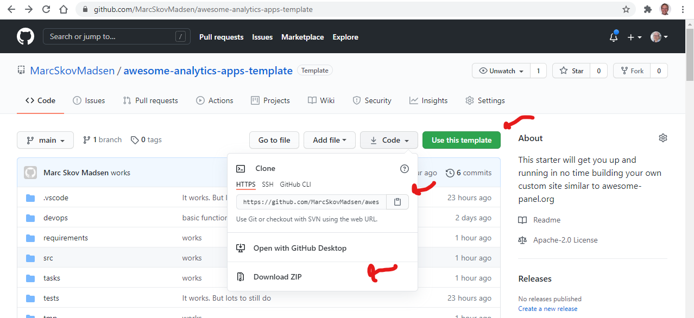

# Awesome Analytics Apps Template

The purpose of this project is to enable you and your team to quickly get up and running building your own site of awesome analytics apps using the tools you know and love.

A site with a look and feel similar to [awesome-panel.org](https://awesome-panel.org).

The site can serve apps developed in

- code files (`.py`) or jupyter notebooks (`.ipynb`).
- Bokeh, Panel or Jupyter IpyWidgets

It can also serve pages and apps developed in Markdown, HTML and any Javascript framework. It can even serve REST API endpoints.

[Gif Intro Video](assets/videos/gif/tour.gif)

In this [Youtube Intro video](https://www.youtube.com/embed/QmwSyQqkKvI) I provide an introduction to the Template.

## Installation

Below we will describe

- installation via pip or conda.
- how to test the installation
- how to serve the site

### Prerequisites

- Python >= 3.7 from [python.org](https://www.python.org/) or Anaconda

It will help a lot if you have experience

- building apps using Bokeh, IpyWidgets or Panel.
- working in
  - an editor or IDE like Spyder, PyCharm or VS Code or
  - a Jupyter Notebook environment.
- working on the command line
- working with virtual environments

If you want to use Docker then you will need to install [Docker Desktop](https://www.docker.com/products/docker-desktop).

### Cloning the Template

Go to the [awesome-analytics-apps-template](https://github.com/MarcSkovMadsen/awesome-analytics-apps-template) and either "Clone", "Download ZIP" or "Use this template".



When done **navigate to the root** of the project.

### Install Using Pip

Move to the **root of the project**. Create a virtual environment named **.venv**.

```bash
python -m venv .venv
```

Activate the virtual environment using something like `source .venv/Scripts/activate` (bash) or `call .venv/Scripts/activate` (cmd.exe).

Update pip

```bash
python -m pip install --upgrade pip
```

Install the requirements for local development and testing.

```bash
pip install -r requirements/local.txt
```

### Install using Conda

```bash
conda create --name mysite
```

You can of course replace `mysite` with the name you prefer.

```bash
conda activate mysite
```

```bash
conda install pip
```

```bash
python -m  pip install -r requirements/local.txt
```

### Enabling Jupyterlab

To use Jupyterlab you need to run

```bash
jupyter labextension install @pyviz/jupyterlab_pyviz
```

### Setting the Python Path

In order to be able to run `python` or `pytest` on specific files you need to set your `PYTHONPATH` to the root of the project.

For example in bash like

```bash
export PYTHONPATH=/path/to/project
```

There are many other ways to set environment variable and they depend on your workflow and use case.

- [VS Code](https://code.visualstudio.com/docs/python/environments#:~:text=pythonPath%20manually%20inside%20your%20User,Settings%2C%20with%20the%20appropriate%20interpreter)
- [PyCharm](https://stackoverflow.com/questions/17198319/how-to-configure-custom-pythonpath-with-vm-and-pycharm)
- [Spyder](https://docs.spyder-ide.org/current/projects.html): Nothing to do. The root of your project is automatically added.

## Test the installation

Test the installation by running the command

```bash
invoke test.all
```

If successfull you will see something like

```bash
All Tests Passed Successfully
=============================
```

## Start the Server

Assuming your PYTHONPATH has been set to the root of the repository you can serve your site via

```bash
invoke site.serve
```

or

```bash
python src/site.py
```

or

```bash
python -m src.site
```

You should then be able to open [localhost:5007](https://localhost:5007) and check out the site.

## Development and Testing

### Customizing the Site

The entrypoint for customizing the Site is the `site.toml` file.

You can customize for example the *name* of the site.

By default this is located in the `src/config` folder. You can change the default `config` folder via the `SITE_CONFIG` environment variable. For example by setting it to `src/config_prod`.

### Adding More Apps

You create a new app by adding it as a subfolder to the `src/apps` folder and then configuring the new app in the `applications.toml` file.

To define and serve the app you need to add it to the `applications.toml` file.

- If you need to add a new Author or Owner you can add him or her via the `persons.toml` file.

#### Best Practice for adding Apps

- Don't place single files directly in `src/apps`
- Don't nest your apps further into for example `src/apps/football/messi/` and `src/apps/football/ronaldo/`. Instead use `src/apps/football_messi/` and `src/apps/football_ronaldo/`.
- Name the main file of your app `app.py`
- Always place app related tests directly in the app folder either as a single `test.py` file or as a `test` subfolder.
- Always add `__init__.py` in your app and test folders. Tools like `pytest`, `mypy` and `pylint` need them for "navigating" your project.
- Always clean all notebooks before `git commit`. Follow the guide [How to clear the Jupyter Notebook outputs automatically?](https://medium.com/somosfit/version-control-on-jupyter-notebooks-6b67a0cf12a3) or manually clean your notebooks using `invoke notebook.clean`.

This will provide the best experience for navigation, continued development, maintainence, refactoring and moving apps when your site grows.

- If the app is a single file. Just add that single file.
- If the app consists of multiple files. Just add a subfolder with the files.

### Remember to Update the Package Requirements

Please note that if start using additional packages, then they should be added to the the relevant file in the `requirements/base.txt` file.

It's recommended to freeze the version. For example to `plotly==4.14.1`.

## Using Static assets

For convenience the site is configured to serve any assets in the `src/assets` folder. This means that you can refer to for example `assets/images/thumbnails/gallery.png` in ..html and or .toml files.

When your site grows and needs more assets its often recommended to store and serve them seperately from your site. But it might not be the fastest solution, c.f. [Self-host Your Static Assets](https://css-tricks.com/self-host-your-static-assets/). But at least storing the assets somewhere differently than in your repo might speed up cloning your repo.

## Customizing the Menu

By default any app added to the `applications.toml` file will be added to the menu in the sidebar of the `templates`.

If you want to customize this further your can do this in the `src/shared/_menu.py` file.

### The Command Line Interface (CLI)

We use [Invoke](http://docs.pyinvoke.org/) as a cli/ task runner to speed up our work flow. Tasks are defined in the `task` module. Available tasks can be listed using the `--list` flag and more information can be obtained using the `--help` flag.

```bash
$ invoke --list
Available tasks:

  docker.build                          Build Docker image
  docker.export-test-results            Copies the test_results from the test image to the local folder 'test_results'
  docker.run                            Run the (prod) Docker image interactively.
  docker.serve                          Start the serve and serve the apps.
  docker.system-prune                   The docker system prune command will free up space
  docker.test                           Run the pre-commit tests inside the docker container
  notebook.clean-all (notebook.clean)   Strips all notebooks of output.
  site.serve                            Starts the Panel server and serves the apps
  test.all                              Runs isort, autoflake, black, pylint, mypy and pytest
  test.autoflake                        Runs autoflake to remove unused imports on all .py files recursively
  test.bandit                           Runs Bandit the security linter from PyCQA.
  test.black                            Runs black (autoformatter) on all .py files recursively
  test.isort                            Runs isort (import sorter) on all .py files recursively
  test.mypy                             Runs mypy (static type checker) on all .py files recursively
  test.pylint                           Runs pylint (linter) on all .py files recursively to identify coding errors
  test.pytest                           Runs pytest to identify failing tests
  test.show-coverage                    Open the code coverage report in a browser
```

## Code Quality

To ensure a high coding standard we use

- [Autoflake](https://github.com/myint/autoflake): Automatically removes unused imports and unused variables
- [Isort](https://pypi.org/project/isort/): Isort your python imports for you so you don’t have to.
- [Black](https://github.com/ambv/black): Black is the uncompromising Python code formatter
- [Pylint](https://www.pylint.org/): Pylint is a tool that checks for errors in Python code, tries to enforce a coding standard and looks for code smells.
- [MyPy](http://mypy-lang.org/index.html): MyPy is a static type checker for Python
- [Pytest](https://docs.pytest.org/en/latest/): The pytest framework makes it easy to write tests
- [Coverage](https://coverage.readthedocs.io/en/v4.5.x/): Coverage.py is a tool for measuring code coverage of Python programs
- [Bandit](https://bandit.readthedocs.io/en/latest/): Bandit is a tool designed to find common security issues in Python code

We have setup *invoke* commands for ease of command line use. For available commands See

```bash
$ invoke --list=test
Available 'test' tasks:

  .all             Runs isort, autoflake, black, pylint, mypy and pytest
  .autoflake       Runs autoflake to remove unused imports on all .py files recursively
  .bandit          Runs Bandit the security linter from PyCQA.
  .black           Runs black (autoformatter) on all .py files recursively
  .isort           Runs isort (import sorter) on all .py files recursively
  .mypy            Runs mypy (static type checker) on all .py files recursively
  .pylint          Runs pylint (linter) on all .py files recursively to identify coding errors
  .pytest          Runs pytest to identify failing tests
  .show-coverage   Open the code coverage report in a browser
```

The best practice is to run `invoke test.all` and fix all errors before any commit. That will help you develop code which works and is long term maintainable.

## Docker

The **build process** consist of building 3 images

`base` -> `prod` -> `test`

- `base` contains the basic requirements. It takes a long time to build but does not need to be rebuilt often.
- `prod` contains the base image and the package
- `test` is build from the prod image, runs the tests and saves test results in the folder /app/test_results. The test results are in the junit format so that they can be published and inspected in Azure Devops.

To build the prod image locally run

```bash
invoke docker.build
```

This will be using cached images and layers. The first time you run this you will need to add the `--rebuild` flag to build the `base` image initially.

To run the tests inside the prod image and export the results to ```./test_results``` run

```bash
invoke docker.test
```

The above commands builds using the cached layers and images, i.e. it is fast. It is not as fast as running the tests locally via the command ```invoke test.all``` though.

When you need to build from scratch, then you should add the ```--rebuild``` flag.

For more information on available ```Invoke docker.*``` commands use the ```--list``` and ```--help``` flags.

## Deployment

Deployment can be a complex topic. The most important resources for deployment are

- [Panel Server Deployment](https://panel.holoviz.org/user_guide/Server_Deployment.html)
- [Bokeh Settings](https://docs.bokeh.org/en/latest/docs/reference/settings.html).

## Contributing

You are very welcome to contribute to this repo via Bugs, Feature Requests and Pull Requests.

## Authors

- Marc Skov Madsen ([Email](mailto:marc.skov.madsen@gmail.com), [LinkedIn](https://www.linkedin.com/in/marcskovmadsen/))

## License

Apache 2

This was chosen since I like to citation as the creator of this. If the license is a problem for you let me know and we will find a solution.


### Roadmap

- Create a tour of the project video
- add command to easily add a new app: `invoke app.add my_new_app`
- add logging
- improve menu generation to highlight active page
- Add examples of resources that open in new tab when clicked in the menu.
- Document FastListTemplate and FastGridTemplate
- add docs and examples on deployments
- add more app examples including ipywidgets examples
  - Lots of independent Plots with widgets layed out in list.
  - Machine Learning App. Just to show how well this use case is supported.
  - Show how to use css only (not template in notebook).
- add command to easily serve a specific app: `invoke app.serve streaming_plots`
- add flags `--dev --show` to `site.serve` and `app.serve` to enable server to reload when files changes.
- add docs app
- add rest api example
- restructure awesome-panel.org to follow the layout of this starter more precisely
- Add more templates: MarkdownTemplate, HTMLTemplate, AccordianTemplate
- Improve the instructions for installing via Conda.
  - I'm not normally a Conda user so contributions are very welcome.
- add support for Streamlit and Dash apps (if technically possible)
